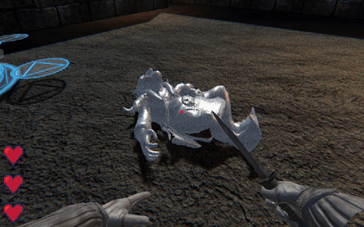
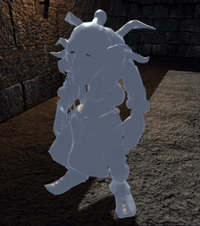
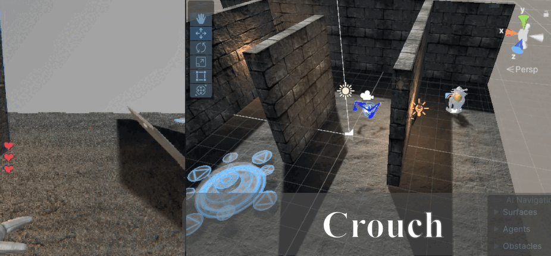
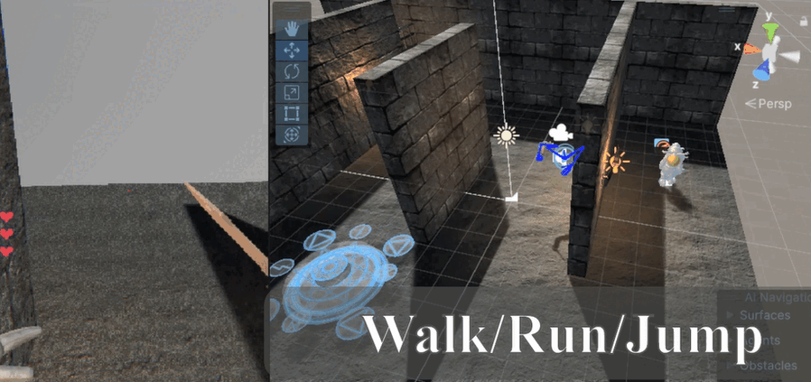
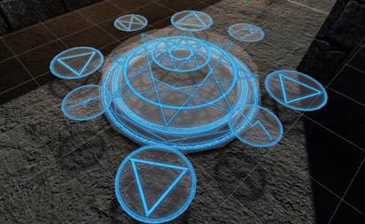
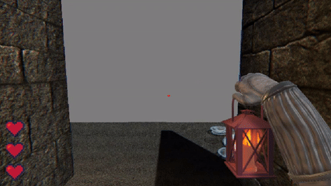
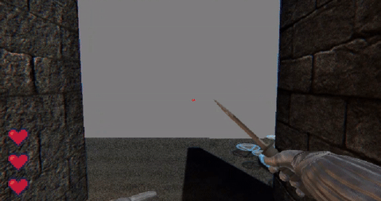
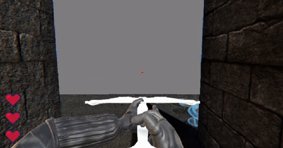
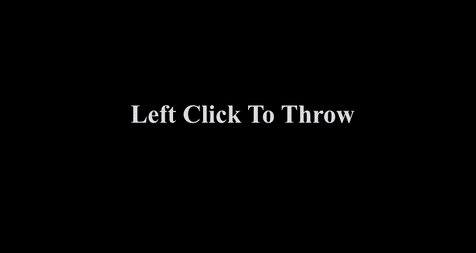

# Game Design Document (GDD)

You can play the following music while reading to understand the atmosphere we want to create in game.

https://github.com/user-attachments/assets/89e0ea39-778f-45b4-b581-7c83900a8c08

### Table of contents
* [Introduction](#introduction)
* [Story and Narrative](#story-and-narrative)
* [Characters](#characters)
* [Gameplay and Mechanics](#gameplay-and-mechanics)
* [Interactive Objects](#interactive-objects)
* [Levels and World Design](#levels-and-world-design)
* [UI](#UI)
* [Art and Audio](#art-and-audio)
* [Technology and Tools](#technology-and-tools)
* [Team Communication, Timelines and Task Assignment](#team-communication,-timelines-and-task-assignment)
* [Possible Challenges](#possible-challenges)

### Introduction
_Shadow Ascent_ is a first-person dark fantasy stealth game set in an ancient, mysterious, **goblin-infested** tower. The player's mission as a fearless adventurer is to carefully sneak past hordes of evil goblins to steal the treasure at the top of the tower. They must explore the tower, avoid enemies and navigate through each floor to uncover the secrets hidden within and escape with their treasure. The game features simple yet intriguing mechanics, such as picking up and interacting with enemy bodies, to enhance the eerie atmosphere and challenge players.

> "Arkham City Predator Mode meets the mechanics of Sekiro, meets the atmosphere of Escape the Backrooms, all set in the universe of Lord of the Rings!" - IGN (real quote)

Players who enjoy stealth-based games, and appreciate a different take on eerie environments without the traditional horror elements will love it!

The game features unique ragdoll body mechanics, allowing the player to pick up defeated enemies to hide them from other enemies, throw them as an attack, trigger traps and more!

  

Genres: Stealth, Psychological, Fantasy, Thriller.

> "Picking up bodies sounds like fun." - Game Designer

> "NO jumpscares :fearful:" - Game Designer

> "GOBLINS!" - Game Designer

### Story and Narrative

The player is set to steal the treasure at the top of an ancient, mystical tower guarded by an angry goblin horde and their king. They must navigate through the tower and avoid enemies to uncover the secrets hidden within and escape with the treasure.

  

### Characters

1. Player: The protagonist - a brave adventurer determined to take the ancient treasure for themselves - you!

2. Enemies: An evil army of goblins patrolling the tower and its riches. They are brutal killing machines, but not the sharpest tools in the shed...
    * Regular Goblin: Henchmen of the king. Quick and dangerous, but can be outsmarted. Takes a backstab to murder.
    * Boss Goblin: A huge, buff goblin with ample health. Impervious to the player's hits, the goblin king has to be defeated by leading him through various traps to outwit him.

  

### Gameplay and Mechanics

Player Perspective: First-person view. The player is not visible on screen except for hands/arms.

  
  

Controls:
* Movement: WASD for movement.
* Run: Hold shift.
* Jump: SPACE.
* Crouch: Ctrl.
* Look around: Mouse movement to move the camera.
* Holding: Right-click for picking up / dropping bodies / objects, left-click while holding to throw.
* Interaction: F to interact with doors, ammo refills, etc.
* Items: Left-click to use items.
* Scroll wheel to cycle through items - or use 1,2,3,4… to select specific items.

  

Progression:
* Objective: Progress through groups of enemies on each floor, collecting useful items, using sacrifice circles to open locked doors and maps to help you navigate. The overarching goal is to climb to the highest level of the tower, beat the goblin king and collect his treasure.
* Difficulty: As the player progresses through the levels, they are introduced to more difficult enemies and challenging mechanics, culminating in a boss battle against the king goblin at the final level of the tower.
* Failure Condition: The player fails if they get defeated (killed) by the enemies, who work together to outnumber and swarm the player once noticed. The player has limited health, so gameplay is more focused on stealth.

Gameplay Mechanics:
* Core Mechanics: The player has to move stealthily, clear obstacles, and interact with enemy bodies to progress.

  
  
  

  * Enemies cannot hear you while crouching.
  * When walking, running, jumping, enemies can hear you and will investigate. Enemies can also hear other objects such as a sacrificial circle activating or a door opening.
  * Move stealthily and kill enemies.

  
  

  * Sacrificial circles can activate mechanisms after receiving a sacrifice.

  

* Rules/Laws: While holding a body, the player’s speed is greatly reduced.

  

* Lantern: Illuminates dark areas but has limited burning time. Needed to find certain useful items like maps in dark rooms.

* Puzzle Mechanics:
    * Sacrifice circles - function like pressure plates for the enemy bodies, where the body activates some kind of event.
    * Navigation - maps on each floor that inform the player about the layout of each area including alternate paths.

### Interactive Objects

* Sacrifice Circles: The occult gods honour the player's wishes if they present a flesh sacrifice - drag dead enemy bodies onto the circle to trigger helpful events, such as opening locked doors.

  
  
  

* Lantern: There is a 'fuel level' that tells you how long the lantern will shine for. Be sure to pickup oil refills to keep the lantern running!

  

* Trusty dagger: The player's tried-and-true stabbing tool (has a very short range, can only backstab enemies).

  

* Crossbow: One-hit-kills regular goblins, but is incredibly loud and attracts the attention of all enemies nearby

  

* GobEye: Can throw it and acts as a camera...

  

* Bodies: The player can pick up, move, and place the bodies of dead enemies in different locations.

### Levels and World Design

Game World:
* Levels: There will be 3 different levels including the final boss battle floor. Each level will be loosely based around a universal layout (similar to Spelunky), with varying items, enemy locations, spawn rooms and more for each floor.

  

  * Level 1: A basic level to introduce the player to the core mechanics of the game and ease them into their surroundings.

  

* The starting room (light blue) looks like this:

  
  

  * It consists of the following game objects:
    * The player spawns in the lower middle jail cell.
    * The red capsule is an enemy.
    * The yellow capsule is an NPC giving instructions to the player, the others are skeletons for ambience.
    * The black box is a bed - falling on the bed makes no noise.
    * The intended path is leave the cell, enter the top cell, climb boxes, and fall onto the bed, where the player can now kill the enemy. The player can then leave through the left door and enter another room. The right door is locked and requires a sacrifice.

  * Level 2: Builds on the first level - introduces player to traps (pressure plates and more) as well as some new items
  * Level 3: Boss level - a few more regular rooms with increased difficulty before a final boss battle against the king goblin, featuring innovative use of traps, items the player has picked up and other mechanics the player has been introduced to.

  

* Environment: The tower interior is a maze of rooms and corridors, consisting of cave systems, dungeons, prison cells and more!

  
  
  
  

* Navigation: Doors may close behind the player to keep the player on track. There will be a top-down minimap for easier navigation, which will only show areas that the player has already explored.

### UI

* Lantern Burn Time: Displayed in the bottom-right corner of the screen. Shows up when you equip the lantern.
* Health Points: Displayed in bottom-left corner of the screen.
* Item you have in hand.
* Minimap: Only shows the areas the player has explored.
* Simple Menu for starting, pausing the game.
* Design: Minimalistic Design.

  
  

### Art and Audio

Art Style: Dark, mostly monochromatic, few colours, simple designs.

Sound Effects: Breathing, footsteps, creaking sounds, faint whispers, goblin dying noises

https://github.com/user-attachments/assets/b994aa28-dc5e-401f-9a84-085d7443fda9

https://github.com/user-attachments/assets/7001fce8-f307-4cf9-9256-be30064ba29b

Music: Eerie ambient noise.

https://github.com/user-attachments/assets/3f5e141d-02db-4ee2-9aab-9e3ce37c50a5

https://github.com/user-attachments/assets/9eee83be-0af7-4335-aae1-d47824cf0c96

Sources: Free assets from Unity Asset Store, free assets from other sources (Mixamo), simple custom assets.

### References:

Goblin:

https://assetstore.unity.com/packages/3d/props/mobile-power-ups-free-vol-1-36106

Level:

https://assetstore.unity.com/packages/3d/environments/dungeons/decrepit-dungeon-lite-33936

Objects:

UI:

https://assetstore.unity.com/packages/2d/gui/icons/heart-in-pixel-287862

Sounds:

https://assetstore.unity.com/packages/audio/sound-fx/weapons/bow-and-hammer-sound-effects-163948

https://assetstore.unity.com/packages/audio/sound-fx/footsteps-small-sound-pack-262072

https://assetstore.unity.com/packages/audio/sound-fx/scary-sound-fx-21523

Shaders:

https://assetstore.unity.com/packages/2d/textures-materials/101-artistic-noise-textures-233672

### Technology and Tools

* Required: Unity, GitHub.
* Assets: Unity Asset Store, Mixamo
* Level Prototyping: Figma, ProBuilder
* Audio Editing Software: Audacity

### Team Communication, Timelines and Task Assignment

Team Communication: Discord. Various channels for each thing (e.g. assets, tutorials, audio, level design, etc.)

Project Management: Trello, when2meet for meeting times.

Timeline:
* 1st Week: Brainstorming.
* 2nd Week: Picking a direction for the game.
* 3rd Week: Finalising Ideas.
* 4th Week: Finding Art/Music.
* 5th Week: Prototyping and submitting GDD.
* 6th Week: Prototype submission and team member evaluation
* 7th Week: Start development of final game
* 8th Week: All level design prototypes finished
* 9th Week: UI and menu implementation
* 10th Week: Player movement and enemy behaviour working
* 11th Week: Particle effects, audio, animations
* 12th Week: Finishing touches, debugging, playthrough feedback
* 1st Week of Exams: Game finished and submitted

Distribution of Work:
* Everyone: Brainstorming, GDD.
* Zach: Formatting GDD, inspiration images, enemy behaviour and animations, various programming tasks
* William: Finding assets for objects, game mechanics sketch, drafting the GDD, player movement and object behaviour
* Aye: Animations and ragdoll physics, dragging enemy mechanism.
* Ken: UI and level design and implementation in game

Prototyping: PlayerController, EnemyMovement, interacting with bodies, test level.

Later (i.e. Assignment 2): (Dagger, crossbow, traps, lantern, sacrifice circles, etc.).

### Possible Challenges

Level Design: Ensure level is engaging but manageable for our skill level.

Puzzle Design: Ensuring that puzzles are interesting and challenging.

Debugging: Will require extensive debugging throughout development process

Ragdoll: Coding ragdoll mechanics for dragging and throwing enemy bodies once killed 

Enemy AI/Behaviour: Programming enemy movement patterns and behaviour for a good stealth game - should be predictable but also adaptable. We don't want them to be too easy or too difficult to defeat.

Smoke Bombs/Traps: Particle effects and ensuring the items are balanced and useful.

Time Management: To meet the 10 min limit.

