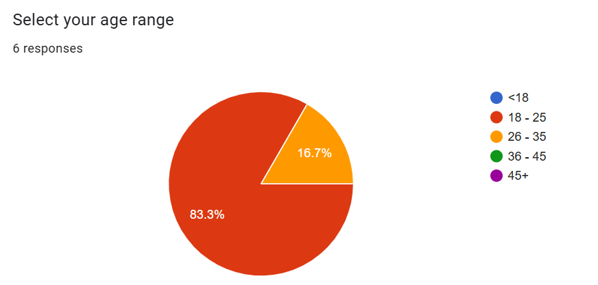
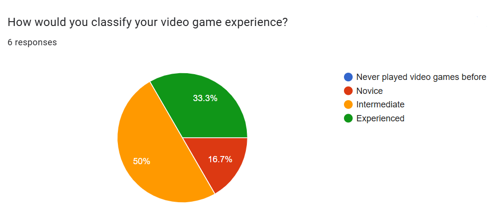
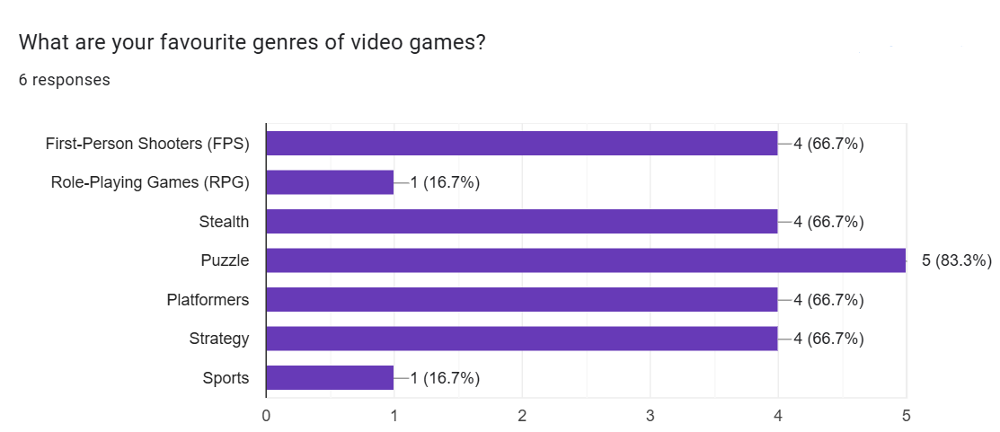
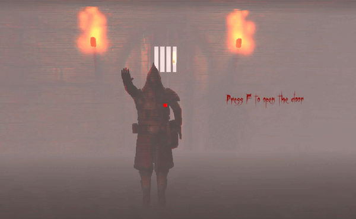
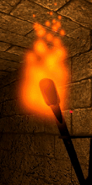

# Project 2 Report

Read the [project 2
specification](https://github.com/feit-comp30019/project-2-specification) for
details on what needs to be covered here. You may modify this template as you see fit, but please
keep the same general structure and headings.

Remember that you must also continue to maintain the Game Design Document (GDD)
in the `GDD.md` file (as discussed in the specification). We've provided a
placeholder for it [here](GDD.md).

## Table of Contents

- [Evaluation Plan](#evaluation-plan)
- [Evaluation Report](#evaluation-report)
- [Shaders and Special Effects](#shaders-and-special-effects)
- [Summary of Contributions](#summary-of-contributions)
- [References and External Resources](#references-and-external-resources)

## Evaluation Plan

**Evaluation Techniques**

Which evaluation techniques will you use and why? What tasks will you ask participants to perform?
- In-person
  - Observational technique - cooperative evaluation
  - Tasks need to cover various areas of the game
    - Level design/navigation – can the user find their way through the levels; do they understand what they are expected to do?
    - Controls – can the user understand and use the controls properly; are they intuitive?
    - Mechanics – does the user understand how the different objects and items in the game function; do they need to be explained?
  - Initially simple tasks
    - Switch through inventory
    - Use weapon
    - Open door
    - Walk forward
    - Etc.
  - Progressing to more complex tasks as the evaluation continues
    - Use the sacrifice circle to open the door
    - Use the crossbow to kill an enemy
    - Use the GobEye to view into the next room
    - Etc.
  - Eventually, hopefully the player can play through with less input from experimenter and just describe their experience

- Online
  - Post-gameplay questionnaire
  - Ask players to complete a single, complete play-through before filling out survey
  - Provide a walkthrough/explanation video if they get stuck
  - Some fixed and some open-ended questions for participants
  - Fixed/quantitative
    - Likert scale (1-5, strongly disagree to strongly agree)
  - Open-ended/qualitative
    - Favourites and least favourites
    - Improvement suggestions
    - Etc.

**Participants**

How will you recruit participants? What qualifying criteria will you use to ensure that they are representative of your target audience?
- Some participants recruited from personal connections (friends and family)
  - Due to time and location limitations these will likely be the in-person test group
- Prioritise people who are unfamiliar with the game, but familiar with games in general, especially stealth/fantasy games
- Target audience is:
  - Age: 16-35
  - Enjoys fantasy and stealth games
  - Intermediate to advanced skill level
  - Familiar with puzzle games/mechanics
  - Likes challenging puzzle/stealth games

**Data collection**

What sort of data is being collected? How will you collect the data? What tools will you use?
- In-person
  - Initially, entire conversation + gameplay recorded
    - Record video of gameplay and audio of player/experimenter conversation
  - OBS Studio used for video recording
  - Audacity for audio recording
  - Get the player to jump and say “jump” verbally to sync recordings

- Online
  - Use surveys (Google Forms) on online forums (r/unimelb subreddit, r/gaming, etc.) as well as posted on notice boards around the University
  - Personal information (to verify target audience)
    - Age
    - Gaming experience
    - Favourite genre of games
    - Etc.
  - Quantitative
    - Likert scale rating (rate from strongly disagree (1) - strongly agree (5))
    - Questions are actually statements, users rate how strongly they agree
    - E.g. The controls were intuitive and easy to use, the mechanics were well-fleshed out and interesting, etc.
  - Qualitative
    - What was your favourite feature of the game?
    - What was your least favourite feature of the game?
    - What is the most important thing you think we should fix/improve?
    - Were the controls easy to understand?
    - Were there any sections of the game you found overly difficult? If so, where and how come?
  - Survey: https://forms.gle/3ku3bfxjhWBWn1sA9

**Data analysis**

How will you analyse the data? What metrics will you use to evaluate your game, and provide a basis for making changes?
- In-person playthrough
  - Separate feedback/issues into groups by
    - Topic/component of game
    - Level design
    - Mechanics
    - Controls
    - Character/environment design
  - Location
    - Level 1 - spawn room
    - Level 2 - final room
    - Etc.
  - Compare these groups for multiple users to identify repeating issues/trends for users

- Online survey
  - Simple statistical measures can be used for the quantitative questions to observe trends in the data
    - Filter to look at target audience vs non-target audience
    - Calculate mean/median/range etc. for our Likert scale ratings (1 = strongly disagree, 5 = strongly agree) and look for consistent trends across surveys and questions
  - Group and analyse similar open-ended responses to identify key trends in the qualitative data
    - Same as in-person, group by component/section
    - Note the key feedback from each survey response

**Timeline**

What is your timeline for completing the evaluation? When will you make changes to the game?
- Evaluation will begin as soon as the evaluation demo is complete (4-7 Oct)
- Due to time constraints, work on the provided feedback will begin at latest by the 16th of October to ensure that there is time to implement the changes
- Feedback/evaluation process is 100% finished by 20 Oct
- Work on game feedback is 100% finished in time for submission by 27th Oct

**Responsibilities**

Who is responsible for each task? How will you ensure that everyone contributes equally?
- Every member of the group needs to recruit AT LEAST 2 people for an in-person cooperative evaluation (we need at least 5 participants)
- The online survey will be created by Zach and reviewed by all members before going live
- Frequent meetings through Discord where everyone shares and discusses their evaluation work to ensure equal contribution

## Evaluation Report

### Participant Demographics

  

  

  

The participant demographics are a good fit to our target audience, especially in the age range and favourite genres. When analysing the responses, it was seen that more experienced (gaming AND genre experience) players found the game to be relatively easy (usually due to their overuse of the crossbow), whereas less experienced players rated the game as being harder (usually due to mechanics and concepts being unclear/poorly explained in-game). Ideally, we wanted the game to be challenging even for players who are experienced and play a lot of stealth/puzzle games, but not impossible for new players to understand.

### Methodology

As explained in the evaluation plan, we used two different methods:
- Cooperative evaluation
- Post-gameplay questionnaire

For cooperative evaluation, the players were tasked with completing the game, but we also requested specific, simpler tasks throughout, such as “Use the eye to check for enemies”, “Open the door”, “Move the barrels to get through” and more. Participants were allowed and encouraged to ask questions and narrate their gameplay, and interviewers took notes of any sections where they struggled or needed help. At the end of the playthrough, we asked some general questions before instructing the participants to also fill out the questionnaire on their own.

For the questionnaire, we used a combination of closed and open ended questions to determine the participants' opinions. We used a Likert scale (strongly agree to strongly disagree) for closed ended statements (like “The environment was eerie”), and allowed paragraph responses for more open ended questions (“Did you ever feel unsure about how to approach a stealth situation? What could’ve helped this?”).
[Questionnaire Link](https://forms.gle/B2PW19q3WQMtekPx6)

### Feedback and Changes

Positive Feedback:
- Players found the world immersive and scary
- Sound effects, especially the heavy breathing and goblin noises, added a lot
- Players liked using the crossbow weapon
- Players enjoyed the parkour and platforming-based areas
- 100% of players reported that they ‘agreed’ or ‘strongly agreed’ that the game was fun to play
- Players enjoyed the creative eye mechanic once they understood it

Constructive Feedback:
- UI/mechanics were not intuitive
  - Feedback:
    - Players did not initially grasp that they were supposed to (or even able to) pick up dead enemies or barrels
    - Players didn't understand how to use the eye mechanic
    - There was too much text on screen with ammo count and lantern timer
  - Changes:
    - Added a tutorial level that explained the grabbing mechanic, how to use the eye and more
    - Added a right-click icon that appears when players hover over grabbable objects
    - Removed most of the UI text and replaced with icons for ammo and inventory

- Crossbow was too overpowered
  - Feedback:
    - Players loved the crossbow, but used it as a primary weapon rather than the knife
    - Large amount of ammo allowed players to just easily speedrun through like a shooter, rather than prioritising stealth and only using the crossbow when spotted
  - Changes:
    - Starting ammo was reduced from 5 to 0, so players had to get familiar with the knife
    - Reduced the frequency of ammo refills
    - Reduced number of arrows in the refills

- Knife gameplay was unclear
  - Feedback:
    - Players weren't aware that they had to backstab goblins, and often tried attacking them head on
  - Changes:
    - Added an explanation and demonstration of the knife to the tutorial
    - Really emphasised the stealth gameplay concept to players in the tutorial, encouraging them to avoid being spotted

- Lantern was useless
  - Feedback:
    - The game environment was light enough that the lantern was totally useless, and most players reported it as their least favourite mechanic
  - Changes:
    - Lowered the brightness overall by a large amount and added some completely pitch-black areas
    - Forces the player to utilise the lantern and increases difficulty since the player needs to manage fuel and switch between items more often
   
- Sprinting was too fast
  - Feedback:
    - Players could abuse high sprint speed to constantly outrun enemies
    - Combined with the slow attack speed and short range of the goblins, players could easily escape them once spotted
    - This detracted from the goblin's scariness and made the game very easy
  - Changes:
    - Decreased sprint speed of player
    - Increased attack speed and range of goblin attack
    - Makes goblin much more intimidating once the player is spotted

- Stealthy movement was impossible
  - Feedback:
    - Players could not sneak around without alerting goblins due to the controls
    - When 'ctrl' (crouch) and 'w' (forward) were pressed together, it would close the game tab
  - Changes:
    - Changed crouch button to 'c'
    - Made crouch a toggle button instead of holding down

## Shaders and Special Effects

**Shader 1: Horror Post Processing Shader**
- [Link to ShaderCode](Assets/Shaders/HorrorPostProcessingShader.shader)
- [Link to Associated Script Code](Assets/Shaders/HorrorPostProcessingScript.cs)

Note: The specific implementation of this shader (i.e. what each parameter is used for) is explained in the code in comments (mainly in the shader code).

Shader Effects:

  

This shader aims to produce ‘horror’ effects reminiscent of surveillance camera footage commonly seen in horror films. The shader creates visual distortions, glitch effects, RGB splitting and other effects, which mimic the eerie, unreliable look of a malfunctioning camera. This enhances the atmosphere and adds an element of dread and tension, immersing the player in a creepy, unsettling environment.

How the shader effects fit into the rendering pipeline:
The shader processes the image that the camera has finished rendering, but before it is actually shown on the screen. It adds ‘special effects’ to the image.

Some effects are done in the vertex shader (distortion, jitter, tearing) while others (RGB split, Noise overlay, scanning bars, glitch effect, fog effect) are done in the fragment shader.
This is because:
1. The vertex shader modifies the vertex positions, and effects like distortion and others change the shapes or positions of objects.
2. The fragment shader handles pixel-level details. The effects mentioned above do not change the shapes or positions of objects. They only affect the appearance of each pixel; their colour, transparency, or overlays.

How the parameters are set:
Parameters such as wave distortion, fog density, and RGB split are set in the shader’s associated C# script using material.SetFloat() or material.SetTexture(). These parameters are set each time OnRenderImage() method is called (i.e. just before displaying the image on screen).

Why parameters are set this way (i.e. from a script):
These parameters allow real-time adjustments from the Unity Inspector (during runtime), so it is much easier to tweak these values to the desired amount.

**Shader 2: Emissive Glow Shader for Sacrifice/Healing Circles**
- [Link to ShaderCode](Assets/Shaders/EmissiveShader.shader)

Shader Effects:

  

The intent of this shader was to create an emissive glowing effect from the sacrifice and healing circles to aid players in locating and using them in the darkened environment, as they are a key game mechanic. It also adds to the eeriness of the game, as the deep pulsating glow from the circles makes them seem otherworldly.

This shader has a vertex and fragment shader. The vertex shader section (which occurs after the input assembly) is simple, as all we need to do is process each vertex by transforming it from object space to clip space, and then pass along its UV coordinates to set the stage for the fragment shader. 

The fragment shader (which is essentially the last rendering step before we draw the output to our buffer) is where the emissive effect is created, based on some values which can be set in the material that parametrises this shader, allowing for many different uses. These parameters are: colour, glow intensity, glow radius and pulse speed. For each fragment, we calculate the distance from the central UV coordinates on the texture, which can then be used for calculating the glow effect. Additionally, we create a pulse effect using a sine function dependent on the time and the pulse speed that was set. Finally, we set the colour for the fragment using the colour and glow intensity parameters, plus the calculated glow effect for this fragment.

The parameters are set through the material using the shader because it allows for flexibility, so the shader effect can be used for different purposes with ease - like for our healing circle, which employs the same shader but via a different material with a green colour. This particular effect is not complex enough to require a script, as we don’t need to activate, deactivate or adjust the effects while they are playing. If this was required, using a script would be easier.

**Particle Effect: Torch Fire Particle System**
- [Link to Particle System](Assets/ObjectAssets/TorchAsset/Prefabs/torch_remade.prefab)

  

In the particle system, we first made it so that the effect is on loop and had the prewarm turned on as the torch will be kept running throughout the game. Since the effect is on loop, the duration does not matter anymore. We had the start speed at 1 and start size at 2 since we wanted it to have a slow, crackly, campfire-like effect. We changed the colour to something more orange to fit the theme we were trying to build.

In the Emission tab, only the rate over time was changed to 15 for a larger more voluminous fire.

In the Shape tab, the shape is a cone. The angle is 0 and the radius is kept small at 0.5 to create a particle system that has the shape of a candle fire where the tip of the fire is a point. The arc is a full 360 and the mode is random to simulate an actual fire that crackles randomly.

In the size over lifetime tab, the size of the particle now decreases over time so that the rogue flame particles grow smaller at the top.

In the Renderer tab, we changed the material so that we used our own torch particle material.

## Summary of Contributions

**Zach:**
- Item switching (ItemSwitcher.cs)
- Sacrifice circle pulsing light shader (EmissiveShader.shader)
- Animations (equip and idle) for lantern, crossbow, holding object and eyeball arms
- Right-click to hold icon when holdable object is detected
- Lantern and crossbow ammo/fuel management systems and refill packs
- Edited gameplay video
- Created Google Forms evaluation feedback survey
- Evaluation plan
- Crossbow logic and arrow firing

**William:**
- Goblin AI and Sound Detection
- Horror Post Processing Shader
- Tutorial Level Design
- Sound Effects
- Provided clips for gameplay video
- Pause menu with resume, restart and quit to menu capabilities

**Sak Panha (Kenneth):**
- First Person controller movement + prefab (FirstPersonControl.cs)
- Interaction with doors (DoorToggle.cs, Interactible.cs)
- Holding, dropping and throwing barrels and goblins (HoldingScript.cs)
- Optimized mesh colliders for barrels (bettercollider.fbx)
- Animated stabbing animation for knife (M9_Knife.controller)
- Lighting system and shadows 
- Inventory panels UI (Panel.prefab)
- Implemented eyeball mechanic (EyeScript.cs)
- Enabling/Disabling quadrants of level to improve performance (QuadrantEnabler.prefab, SceneUnloader.cs)

**Aye:**

## References and External Resources

TODO (to be continuously updated) - see specification for details
